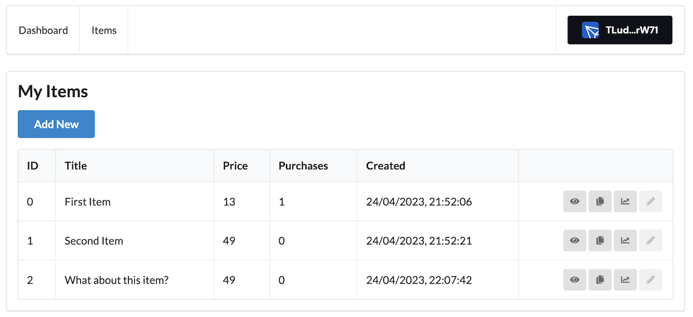

# OptriPay Contracts V1

Welcome to OptriPay, a decentralized marketplace web application built for
educational purposes. This project allows sellers to create and sell their own
items, with all data securely stored on the blockchain. Please note that the
existing codebase has not been audited, and this version represents our initial
concept of creating a marketplace using crypto payments (USDT on Tron).

[Here is the smart contracts repository](https://github.com/optriment/optripay-contracts-v1)

## Screenshots

### Landing Page

### Seller Area

### Buyer Area

### Item Screen

## Features

1. **Platform Fees:** A fee of 1-5% of the item's price will be charged from
   the seller for each transaction.
2. **Beneficiary Configuration:** The contract's owner has the ability to
   change the beneficiary of the service fee.
3. **Seller Functionality:** Sellers can add new items, update existing items,
   list their own items for sale, and view the purchases made on their items.
   Additionally, sellers can track their total income from sales.
4. **Buyer Functionality:** Buyers can purchase a specific item multiple times
   and view their own purchase history.
5. **Platform Owner Control:** The platform owner has the authority to change
   the platform's commission fee, set a new beneficiary for the service fee,
   and monitor the total income generated by the platform.

## Contributing

We welcome contributions to improve OptriPay. If you'd like to contribute,
please follow these guidelines:

- Fork the repository and create a new branch for your feature or bug fix.
- Ensure that your code adheres to the existing coding standards.
- Test your changes thoroughly.
- Create a pull request, explaining the purpose and changes of your contribution.

## Disclaimer

This project is intended for educational purposes only. The existing codebase
has not undergone a formal audit. Please use this software at your own risk,
and we disclaim any liability for its use or any damages it may cause.

## License

This project is licensed under the MIT License. Feel free to use, modify, and
distribute the codebase for educational and non-commercial purposes.

## Contact

If you have any questions or suggestions regarding this project, please feel
free to contact us at [office@optriment.com](mailto:office@optriment.com). We
appreciate your feedback!
